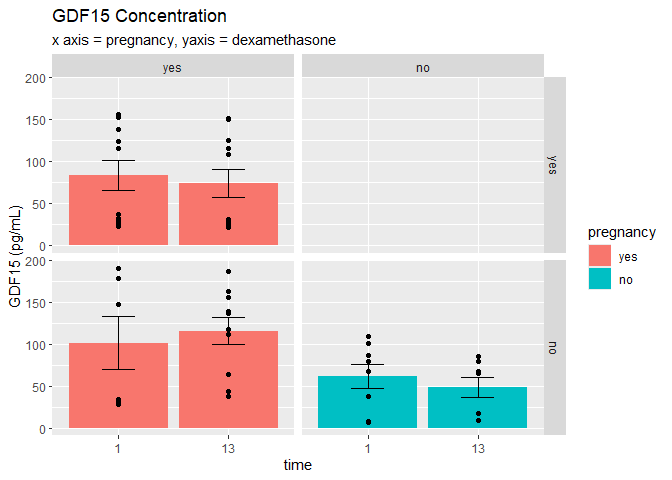
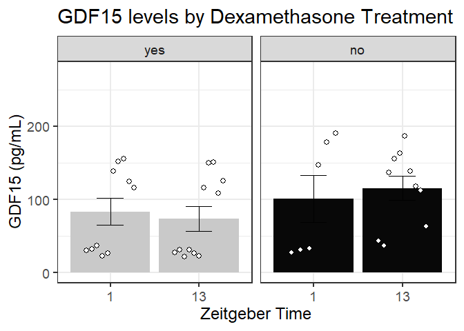
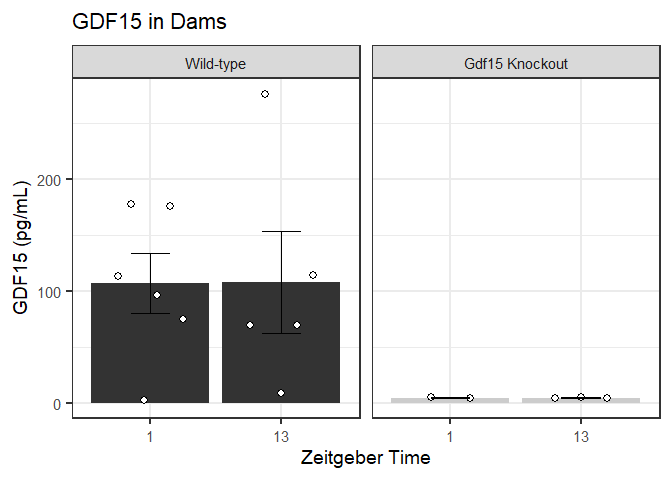

     

```r
##old 2020 plate with 2022 standard
reanalyzed.plate<-"2020plate2022std.csv"

plate.data<-read_csv(reanalyzed.plate,
                     col_types =cols(
                       Sample = col_factor(levels = NULL),
                       Well = col_factor(levels = NULL),
                       Raw = col_double(),
                       `Background Corrected`  = col_double(),
                       Conc.  = col_double(),
                       plate= col_factor(levels = NULL),
                       volume = col_double()
                     ))

map.plate<-"GDF15_mapping.csv"

map.data.plate<-read_csv(map.plate,
                         col_types = cols(
                           MouseID = col_factor(levels = NULL),
                           time = col_factor(levels = NULL),
                           pregnancy = col_factor(levels = c("yes","no")),
                           trimester = col_factor(levels = NULL),
                           Diet = col_factor(levels = c("NCD","KD","eTRF","AL")),
                           sex = col_factor(levels = c("male","female")),
                           week = col_double(),
                           Well = col_factor(levels = NULL),
                           Study = col_factor(levels = c("IR","TRF","AJ","TSC")),
                           Genotype = col_factor(levels = c("WT","KO")),
                           dex = col_factor(levels = c("yes","no"))
                         ))
old.plate.mapped<-merge(plate.data, map.data.plate, by = "Well")
#Merge this with the new plate data
old.plate.reduced<-old.plate.mapped%>%
  select(Conc., plate, volume, MouseID, time, pregnancy, trimester, Diet, sex, week, Study, Genotype, dex)%>%
mutate(concentration = Conc.*50/volume)

##New plate read
new.plate<-"2022plate2022std_reads.csv"
new.plate.data<-read_csv(new.plate,
                         col_types = cols(
                           Sample = col_factor(levels = NULL),
                           Well = col_factor(levels = NULL),
                           Raw = col_double(),
                           "Background\nCorrected" = col_double(),
                           Conc. = col_double() 
                           ))
new.map<-"test.GDF15.csv"
new.map.plate<-read_csv(new.map,
                        col_types = cols(
                          MouseID = col_factor(levels = NULL),
                          Genotype = col_factor(levels=c("WT","KO")),
                          pregnancy = col_factor(levels = c("yes","no")),
                          volume = col_double(),
                          Study = col_factor(levels = c("GDF15","TRF","IR")),
                          dex = col_factor(levels = c("yes","no")),
                          Well = col_factor(levels = NULL),
                          Diet = col_factor(levels = c("NCD","eTRF","AL")),
                          plate = col_factor(levels = NULL),
                          time = col_factor(levels = c("1","13"))
                        ))

new.plate.mapped<-merge(new.plate.data, new.map.plate, by = "Well")

new.plate.reduced<-new.plate.mapped%>%
  select(Conc., plate, volume, MouseID, time, pregnancy, Diet,Study, Genotype, dex)%>%
mutate(concentration = Conc.*50/volume)

#merge the two plates
both.plate.data<-full_join(new.plate.reduced, old.plate.reduced)
```


```r
test<-both.plate.data%>%
  filter(Study=="IR")%>%
  group_by(dex, pregnancy, time)%>%
  summarize(avg = mean(concentration),
            error = se(concentration))
  ggplot()+
  geom_col(data = test, aes(time, avg, fill = pregnancy))+
  geom_point(data = filter(both.plate.data, Study=="IR"),aes(x=time, y=concentration))+
  facet_grid(dex~pregnancy)+
  geom_errorbar(data = test, aes(x = time, y = avg, ymin = avg-error, ymax = avg+error), width = 0.3)+
  labs(title = "GDF15 Concentration", y="GDF15 (pg/mL)", subtitle = "x axis = pregnancy, yaxis = dexamethasone")
```

<!-- -->

```r
  IR.data.dex<-both.plate.data%>%
  filter(Study=="IR")%>%
  filter(pregnancy=="yes")
  library(lme4)
library(lmerTest)
  dex.gdf15.mlm<-lmer(concentration~ time + dex + (1|MouseID), data = IR.data.dex)
  summary(dex.gdf15.mlm)
```

```
## Linear mixed model fit by REML. t-tests use Satterthwaite's method [
## lmerModLmerTest]
## Formula: concentration ~ time + dex + (1 | MouseID)
##    Data: IR.data.dex
## 
## REML criterion at convergence: 381
## 
## Scaled residuals: 
##    Min     1Q Median     3Q    Max 
## -1.405 -0.884  0.133  0.798  1.369 
## 
## Random effects:
##  Groups   Name        Variance Std.Dev.
##  MouseID  (Intercept)    0      0.0    
##  Residual             3447     58.7    
## Number of obs: 37, groups:  MouseID, 13
## 
## Fixed effects:
##             Estimate Std. Error     df t value Pr(>|t|)    
## (Intercept)   78.359     16.412 34.000    4.77 0.000034 ***
## time13         0.183     19.582 34.000    0.01     0.99    
## dexno         31.767     19.582 34.000    1.62     0.11    
## ---
## Signif. codes:  0 '***' 0.001 '**' 0.01 '*' 0.05 '.' 0.1 ' ' 1
## 
## Correlation of Fixed Effects:
##        (Intr) time13
## time13 -0.625       
## dexno  -0.447 -0.101
## optimizer (nloptwrap) convergence code: 0 (OK)
## boundary (singular) fit: see help('isSingular')
```

```r
  IR.data.pg<-both.plate.data%>%
  filter(Study=="IR")%>%
  filter(dex=="no")

pg.gdf15.mlm<-lmer(concentration~ time + pregnancy + (1|MouseID), data = IR.data.pg)
  summary(pg.gdf15.mlm)
```

```
## Linear mixed model fit by REML. t-tests use Satterthwaite's method [
## lmerModLmerTest]
## Formula: concentration ~ time + pregnancy + (1 | MouseID)
##    Data: IR.data.pg
## 
## REML criterion at convergence: 308
## 
## Scaled residuals: 
##    Min     1Q Median     3Q    Max 
## -1.598 -0.912  0.222  0.666  1.563 
## 
## Random effects:
##  Groups   Name        Variance Std.Dev.
##  MouseID  (Intercept)    0      0.0    
##  Residual             2655     51.5    
## Number of obs: 31, groups:  MouseID, 15
## 
## Fixed effects:
##             Estimate Std. Error      df t value Pr(>|t|)    
## (Intercept)  109.987     17.450  28.000    6.30  8.1e-07 ***
## time13         0.405     18.835  28.000    0.02    0.983    
## pregnancyno  -54.609     18.756  28.000   -2.91    0.007 ** 
## ---
## Signif. codes:  0 '***' 0.001 '**' 0.01 '*' 0.05 '.' 0.1 ' ' 1
## 
## Correlation of Fixed Effects:
##             (Intr) time13
## time13      -0.675       
## pregnancyno -0.614  0.159
## optimizer (nloptwrap) convergence code: 0 (OK)
## boundary (singular) fit: see help('isSingular')
```

```r
  #Plot np vs pregnant
  avg.pg.data<-IR.data.pg%>%
    group_by(pregnancy, time)%>%
    summarise(avg.gdf=mean(concentration),
              error.gdf = se(concentration))
    ggplot()+
    geom_col(data= avg.pg.data, aes(x=time, y = avg.gdf, fill = pregnancy, group = pregnancy ),position = position_dodge(1.0))+
    geom_point(data = IR.data.pg, aes(x=time, y=concentration, group = pregnancy), position = position_dodge2(width = 0.6))+
      ylim(0,275)+
       geom_errorbar(data = avg.pg.data, aes(x=time, y=avg.gdf, ymax = avg.gdf+error.gdf, ymin = avg.gdf-error.gdf), width = 0.3)+
      facet_grid(.~pregnancy)+
    scale_fill_manual(values = c("grey45", "grey3"))+
      labs(title = "GDF15 levels by Pregnancy Status", y= "GDF15 (pg/mL)", x= "Zeitgeber Time")+
  theme_bw(base_size=18) +
      theme(legend.position="none")
```

<!-- -->

```r
#plot, dex vs water dams
    avg.dex.data<-IR.data.dex%>%
      group_by(time, dex)%>%
      summarise(avg.gdf=mean(concentration),
              error.gdf = se(concentration))
    
    ggplot()+
    geom_col(data= avg.dex.data, aes(x=time, y = avg.gdf, fill = dex, group = dex ),position = position_dodge(1.0))+
    geom_point(data = IR.data.dex, aes(x=time, y=concentration, group = dex), position = position_dodge2(width = 0.6))+
       geom_errorbar(data = avg.dex.data, aes(x=time, y=avg.gdf, ymax = avg.gdf+error.gdf, ymin = avg.gdf-error.gdf), width = 0.3)+
        ylim(0,275)+
      facet_grid(.~dex)+
    scale_fill_manual(values = c("grey79","grey3"))+
      labs(title = "GDF15 levels by Dexamethasone Treatment", y= "GDF15 (pg/mL)", x= "Zeitgeber Time")+
  theme_bw(base_size=18)+
      theme(legend.position="none")
```

<!-- -->


```r
summary.Gdf<-both.plate.data%>%
  filter(Study=="GDF15")%>%
  group_by(time, Genotype)%>%
  summarise(avg = mean(concentration),
            error = se(concentration))
  

ggplot()+
  geom_col(data = summary.Gdf, aes(x=time, y=avg, fill = Genotype, group = Genotype), position = position_dodge(1.0))+
  geom_point(data = filter(both.plate.data, Study =="GDF15"), aes(x=time, y=concentration, group = Genotype), position = position_dodge2(width = 0.6))+
  labs(title = "GDF15 in Dams",y="GDF15 (pg/mL)", x= "zeitgeber time (hours from midnight)")+
  facet_grid(.~Genotype)+
 geom_errorbar(data = summary.Gdf, aes(x=time, y=avg, ymax = avg+error, ymin = avg-error), width = 0.3)+
    scale_fill_manual(values = c("#00274C","#A5A508"))+
  theme_bw()+
  theme(text = element_text(size=14), legend.position = "none")
```

<!-- -->


```
