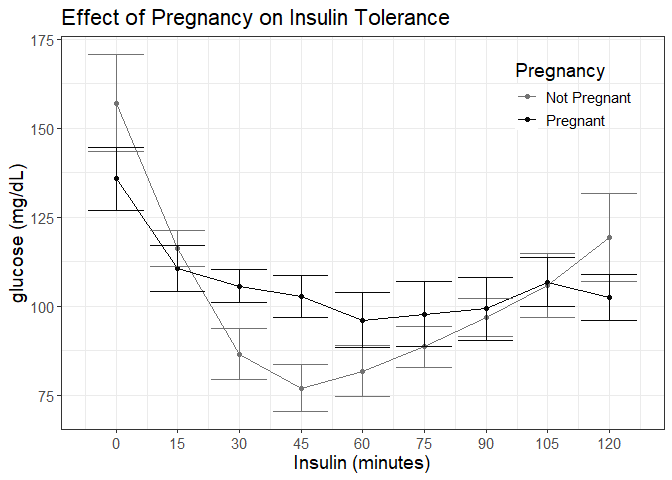
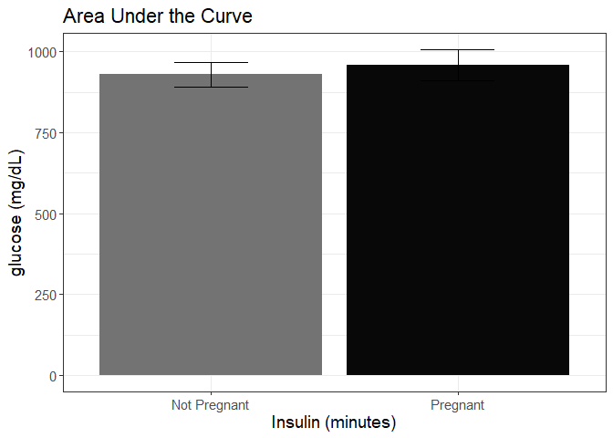
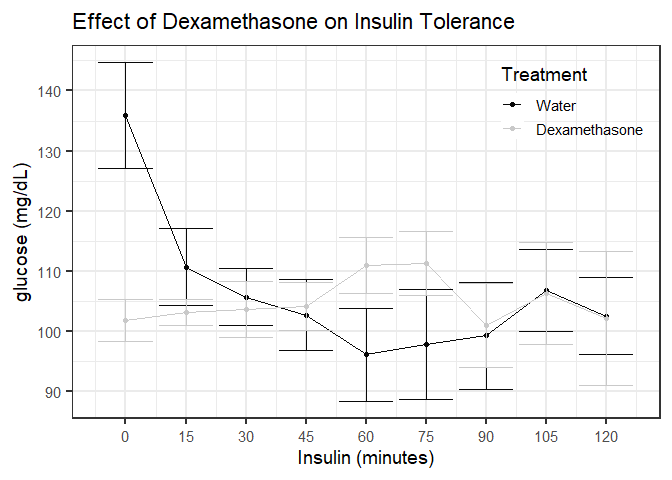
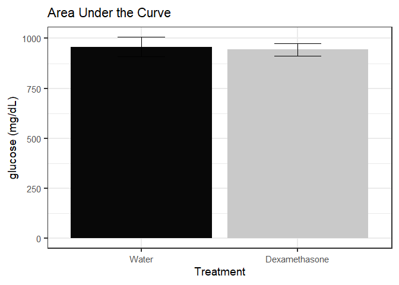
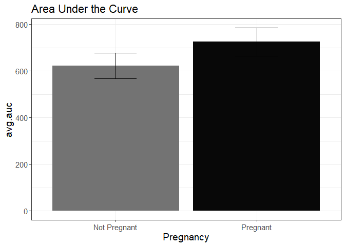
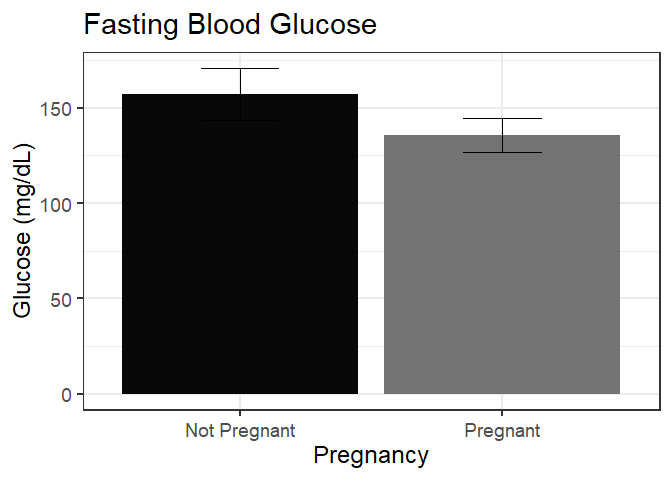
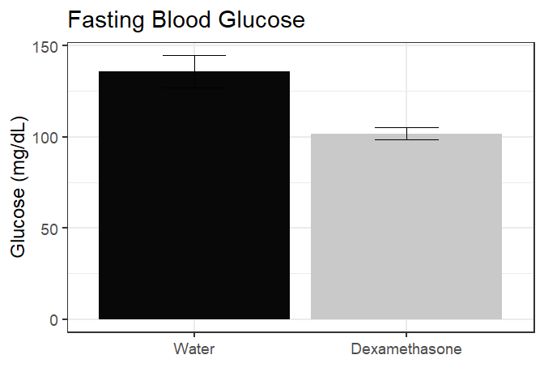
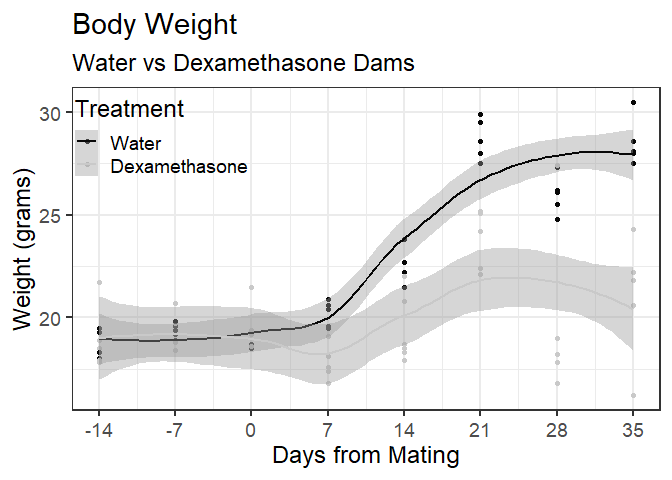
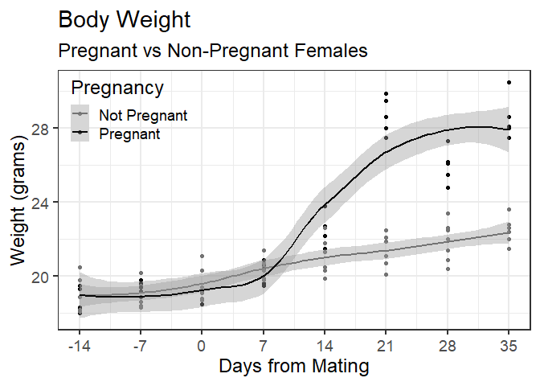
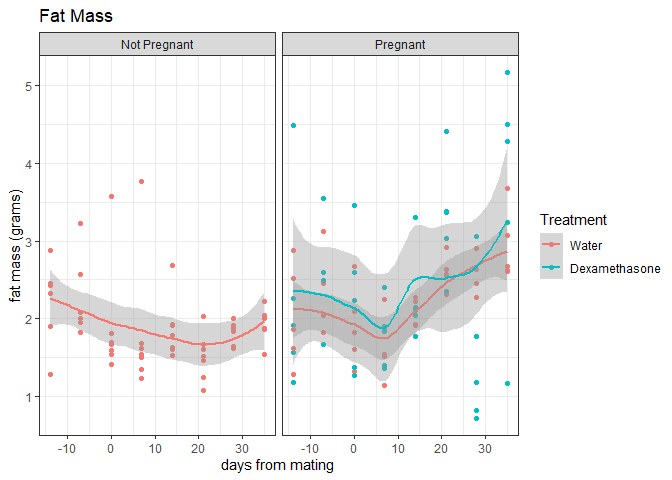

```r
#load commonly needed packages
library(processx)
library(devtools)
```

```
## Loading required package: usethis
```

```r
library(tidyr)
library(dplyr)
```

```
## 
## Attaching package: 'dplyr'
```

```
## The following objects are masked from 'package:stats':
## 
##     filter, lag
```

```
## The following objects are masked from 'package:base':
## 
##     intersect, setdiff, setequal, union
```

```r
library(readr)
library(ggplot2)
library(knitr)
library(car)
```

```
## Loading required package: carData
```

```
## 
## Attaching package: 'car'
```

```
## The following object is masked from 'package:dplyr':
## 
##     recode
```

```r
library(lme4)
```

```
## Loading required package: Matrix
```

```
## 
## Attaching package: 'Matrix'
```

```
## The following objects are masked from 'package:tidyr':
## 
##     expand, pack, unpack
```

```r
library(broom)
library(forcats)

#figures made will go to directory called figures, will make them as both png and pdf files 
opts_chunk$set(fig.path='figures/',
               echo=FALSE, warning=FALSE, message=FALSE,dev=c('png','pdf'))
options(scipen = 2, digits = 3)
# set echo and message to TRUE if you want to display code blocks and code output respectively
knitr::knit_hooks$set(inline = function(x) {
  knitr:::format_sci(x, 'md')
})
se <- function(x) sd(x, na.rm=T)/sqrt(length(x))
```

#load data

#data analysis
<!-- --><!-- -->

```
## Linear mixed model fit by REML ['lmerMod']
## Formula: glucose ~ time + Pregnancy + (1 | ID)
##    Data: pregnant.data
## 
## REML criterion at convergence: 1264
## 
## Scaled residuals: 
##    Min     1Q Median     3Q    Max 
## -2.240 -0.633 -0.075  0.428  3.465 
## 
## Random effects:
##  Groups   Name        Variance Std.Dev.
##  ID       (Intercept)  95.7     9.78   
##  Residual             666.9    25.82   
## Number of obs: 135, groups:  ID, 15
## 
## Fixed effects:
##                   Estimate Std. Error t value
## (Intercept)       113.6917     5.7518   19.77
## time               -0.1733     0.0574   -3.02
## PregnancyPregnant   3.1210     6.7445    0.46
## 
## Correlation of Fixed Effects:
##             (Intr) time  
## time        -0.599       
## PrgnncyPrgn -0.547  0.000
```

```
## 
## 	Shapiro-Wilk normality test
## 
## data:  pregnant.auc$AUC[pregnant.auc$Pregnancy == "Pregnant"]
## W = 0.9, p-value = 0.1
```

```
## 
## 	Shapiro-Wilk normality test
## 
## data:  pregnant.auc$AUC[pregnant.auc$Pregnancy == "Not Pregnant"]
## W = 1, p-value = 0.8
```

```
## Levene's Test for Homogeneity of Variance (center = median)
##       Df F value Pr(>F)
## group  1    0.24   0.63
##       13
```

```
## 
## 	Welch Two Sample t-test
## 
## data:  AUC by Pregnancy
## t = -0.5, df = 12, p-value = 0.7
## alternative hypothesis: true difference in means between group Not Pregnant and group Pregnant is not equal to 0
## 95 percent confidence interval:
##  -162  106
## sample estimates:
## mean in group Not Pregnant     mean in group Pregnant 
##                        930                        958
```

<!-- --><!-- -->

```
## Linear mixed model fit by REML ['lmerMod']
## Formula: glucose ~ time + Treatment + (1 | ID)
##    Data: dex.data
## 
## REML criterion at convergence: 984
## 
## Scaled residuals: 
##    Min     1Q Median     3Q    Max 
## -1.983 -0.611 -0.060  0.508  3.700 
## 
## Random effects:
##  Groups   Name        Variance Std.Dev.
##  ID       (Intercept) 119      10.9    
##  Residual             233      15.3    
## Number of obs: 117, groups:  ID, 13
## 
## Fixed effects:
##                        Estimate Std. Error t value
## (Intercept)            111.8537     5.0427   22.18
## time                    -0.0907     0.0365   -2.49
## TreatmentDexamethasone  -1.4497     6.6880   -0.22
## 
## Correlation of Fixed Effects:
##             (Intr) time  
## time        -0.434       
## TrtmntDxmth -0.612  0.000
```

```
## 
## 	Shapiro-Wilk normality test
## 
## data:  dex.auc$AUC[dex.auc$Treatment == "Water"]
## W = 0.9, p-value = 0.1
```

```
## 
## 	Shapiro-Wilk normality test
## 
## data:  dex.auc$AUC[dex.auc$Treatment == "Dexamethasone"]
## W = 0.9, p-value = 0.4
```

```
## Levene's Test for Homogeneity of Variance (center = median)
##       Df F value Pr(>F)
## group  1    0.84   0.38
##       11
```

```
## 
## 	Welch Two Sample t-test
## 
## data:  AUC by Treatment
## t = 0.2, df = 10, p-value = 0.8
## alternative hypothesis: true difference in means between group Water and group Dexamethasone is not equal to 0
## 95 percent confidence interval:
##  -116  142
## sample estimates:
##         mean in group Water mean in group Dexamethasone 
##                         958                         945
```

<!-- --><!-- --><!-- -->

```
## 
## 	Shapiro-Wilk normality test
## 
## data:  pregnant.auc$rel.auc[pregnant.auc$Pregnancy == "Not Pregnant"]
## W = 0.9, p-value = 0.3
```

```
## 
## 	Shapiro-Wilk normality test
## 
## data:  pregnant.auc$rel.auc[pregnant.auc$Pregnancy == "Pregnant"]
## W = 0.9, p-value = 0.3
```

```
## Levene's Test for Homogeneity of Variance (center = median)
##       Df F value Pr(>F)
## group  1    0.18   0.68
##       13
```

```
## 
## 	Welch Two Sample t-test
## 
## data:  rel.auc by Pregnancy
## t = -1, df = 13, p-value = 0.2
## alternative hypothesis: true difference in means between group Not Pregnant and group Pregnant is not equal to 0
## 95 percent confidence interval:
##  -279.1   74.6
## sample estimates:
## mean in group Not Pregnant     mean in group Pregnant 
##                        623                        725
```

```
## Data: preg.data
## Models:
## null.relglu.mlm: rel.glucose ~ 1 + (1 | ID)
## time.relglu.mlm: rel.glucose ~ time + (1 | ID)
##                 npar  AIC  BIC logLik deviance Chisq Df Pr(>Chisq)   
## null.relglu.mlm    3 1180 1189   -587     1174                       
## time.relglu.mlm    4 1173 1184   -582     1165  9.69  1     0.0019 **
## ---
## Signif. codes:  0 '***' 0.001 '**' 0.01 '*' 0.05 '.' 0.1 ' ' 1
```

```
## Data: preg.data
## Models:
## time.relglu.mlm: rel.glucose ~ time + (1 | ID)
## preg.relglu.mlm: rel.glucose ~ time + Pregnancy + (1 | ID)
##                 npar  AIC  BIC logLik deviance Chisq Df Pr(>Chisq)
## time.relglu.mlm    4 1173 1184   -582     1165                    
## preg.relglu.mlm    5 1173 1188   -582     1163  1.71  1       0.19
```

```
## Analysis of Deviance Table (Type II Wald chisquare tests)
## 
## Response: rel.glucose
##                Chisq Df Pr(>Chisq)   
## time            9.93  1     0.0016 **
## Pregnancy       1.57  1     0.2096   
## time:Pregnancy  0.08  1     0.7812   
## ---
## Signif. codes:  0 '***' 0.001 '**' 0.01 '*' 0.05 '.' 0.1 ' ' 1
```

```
## Linear mixed model fit by REML ['lmerMod']
## Formula: rel.glucose ~ time * Pregnancy + (1 | ID)
##    Data: preg.data
## 
## REML criterion at convergence: 1160
## 
## Scaled residuals: 
##    Min     1Q Median     3Q    Max 
## -2.075 -0.581 -0.101  0.447  2.624 
## 
## Random effects:
##  Groups   Name        Variance Std.Dev.
##  ID       (Intercept) 277      16.7    
##  Residual             256      16.0    
## Number of obs: 135, groups:  ID, 15
## 
## Fixed effects:
##                        Estimate Std. Error t value
## (Intercept)             75.3563     6.8374   11.02
## time                    -0.1027     0.0487   -2.11
## PregnancyPregnant       12.5442    10.0089    1.25
## time:PregnancyPregnant  -0.0198     0.0712   -0.28
## 
## Correlation of Fixed Effects:
##             (Intr) time   PrgnnP
## time        -0.427              
## PrgnncyPrgn -0.683  0.292       
## tm:PrgnncyP  0.292 -0.683 -0.427
```

```
## Data: dex.data.itt
## Models:
## null.dex.mlm: rel.glucose ~ 1 + (1 | ID)
## time.dex.mlm: rel.glucose ~ time + (1 | ID)
##              npar AIC BIC logLik deviance Chisq Df Pr(>Chisq)  
## null.dex.mlm    3 960 968   -477      954                      
## time.dex.mlm    4 957 968   -475      949  4.66  1      0.031 *
## ---
## Signif. codes:  0 '***' 0.001 '**' 0.01 '*' 0.05 '.' 0.1 ' ' 1
```

```
## Data: dex.data.itt
## Models:
## time.dex.mlm: rel.glucose ~ time + (1 | ID)
## treat.dex.mlm: rel.glucose ~ time + Treatment + (1 | ID)
##               npar AIC BIC logLik deviance Chisq Df Pr(>Chisq)   
## time.dex.mlm     4 957 968   -475      949                       
## treat.dex.mlm    5 952 966   -471      942  7.25  1     0.0071 **
## ---
## Signif. codes:  0 '***' 0.001 '**' 0.01 '*' 0.05 '.' 0.1 ' ' 1
```

```
## Linear mixed model fit by REML ['lmerMod']
## Formula: rel.glucose ~ time * Treatment + (1 | ID)
##    Data: dex.data.itt
## 
## REML criterion at convergence: 935
## 
## Scaled residuals: 
##     Min      1Q  Median      3Q     Max 
## -2.2007 -0.6699 -0.0902  0.5144  2.6759 
## 
## Random effects:
##  Groups   Name        Variance Std.Dev.
##  ID       (Intercept) 190      13.8    
##  Residual             136      11.7    
## Number of obs: 117, groups:  ID, 13
## 
## Fixed effects:
##                             Estimate Std. Error t value
## (Intercept)                  87.9004     5.8721   14.97
## time                         -0.1225     0.0379   -3.23
## TreatmentDexamethasone       14.9502     8.6435    1.73
## time:TreatmentDexamethasone   0.1315     0.0559    2.35
## 
## Correlation of Fixed Effects:
##             (Intr) time   TrtmnD
## time        -0.388              
## TrtmntDxmth -0.679  0.263       
## tm:TrtmntDx  0.263 -0.679 -0.388
```


<!-- -->

```
## 
## 	Shapiro-Wilk normality test
## 
## data:  pregnancy.FBG$glucose[pregnancy.FBG$Pregnancy == "Not Pregnant"]
## W = 0.9, p-value = 0.4
```

```
## 
## 	Shapiro-Wilk normality test
## 
## data:  pregnancy.FBG$glucose[pregnancy.FBG$Pregnancy == "Pregnant"]
## W = 0.9, p-value = 0.5
```

```
## Levene's Test for Homogeneity of Variance (center = median)
##       Df F value Pr(>F)
## group  1    0.55   0.47
##       13
```

```
## 
## 	Welch Two Sample t-test
## 
## data:  glucose by Pregnancy
## t = 1, df = 12, p-value = 0.2
## alternative hypothesis: true difference in means between group Not Pregnant and group Pregnant is not equal to 0
## 95 percent confidence interval:
##  -14.2  56.8
## sample estimates:
## mean in group Not Pregnant     mean in group Pregnant 
##                        157                        136
```

<!-- -->

```
## 
## 	Shapiro-Wilk normality test
## 
## data:  dex.FBG$glucose[dex.FBG$Treatment == "Water"]
## W = 0.9, p-value = 0.5
```

```
## 
## 	Shapiro-Wilk normality test
## 
## data:  dex.FBG$glucose[dex.FBG$Treatment == "Dexamethasone"]
## W = 0.9, p-value = 0.6
```

```
## Levene's Test for Homogeneity of Variance (center = median)
##       Df F value Pr(>F)  
## group  1    4.23  0.064 .
##       11                 
## ---
## Signif. codes:  0 '***' 0.001 '**' 0.01 '*' 0.05 '.' 0.1 ' ' 1
```

```
## 
## 	Welch Two Sample t-test
## 
## data:  glucose by Treatment
## t = 4, df = 8, p-value = 0.007
## alternative hypothesis: true difference in means between group Water and group Dexamethasone is not equal to 0
## 95 percent confidence interval:
##  12.1 56.0
## sample estimates:
##         mean in group Water mean in group Dexamethasone 
##                         136                         102
```


<!-- --><!-- --><!-- --><!-- -->

```
## Linear mixed model fit by REML ['lmerMod']
## Formula: Weight ~ experiment.time + Treatment + (1 | animal.MouseID)
##    Data: pregnancy.data
## 
## REML criterion at convergence: 408
## 
## Scaled residuals: 
##    Min     1Q Median     3Q    Max 
## -2.465 -0.728 -0.169  0.635  2.314 
## 
## Random effects:
##  Groups         Name        Variance Std.Dev.
##  animal.MouseID (Intercept) 0.00     0.00    
##  Residual                   6.83     2.61    
## Number of obs: 85, groups:  animal.MouseID, 10
## 
## Fixed effects:
##                        Estimate Std. Error t value
## (Intercept)              21.525      0.458   46.98
## experiment.time           0.111      0.013    8.51
## TreatmentDexamethasone   -2.765      0.575   -4.81
## 
## Correlation of Fixed Effects:
##             (Intr) exprm.
## expermnt.tm -0.511       
## TrtmntDxmth -0.674  0.167
## optimizer (nloptwrap) convergence code: 0 (OK)
## boundary (singular) fit: see help('isSingular')
```

```
## Analysis of Deviance Table (Type II Wald chisquare tests)
## 
## Response: Weight
##                 Chisq Df Pr(>Chisq)    
## experiment.time  72.4  1    < 2e-16 ***
## Treatment        23.1  1  0.0000015 ***
## ---
## Signif. codes:  0 '***' 0.001 '**' 0.01 '*' 0.05 '.' 0.1 ' ' 1
```

```
## Linear mixed model fit by REML ['lmerMod']
## Formula: Weight ~ experiment.time + Pregnancy + (1 | animal.MouseID)
##    Data: water.data
## 
## REML criterion at convergence: 498
## 
## Scaled residuals: 
##    Min     1Q Median     3Q    Max 
## -2.167 -0.564 -0.162  0.356  4.159 
## 
## Random effects:
##  Groups         Name        Variance Std.Dev.
##  animal.MouseID (Intercept) 0.23     0.48    
##  Residual                   5.67     2.38    
## Number of obs: 107, groups:  animal.MouseID, 12
## 
## Fixed effects:
##                   Estimate Std. Error t value
## (Intercept)       19.43932    0.38495   50.50
## experiment.time    0.13942    0.00889   15.69
## PregnancyPregnant  1.57413    0.54584    2.88
## 
## Correlation of Fixed Effects:
##             (Intr) exprm.
## expermnt.tm -0.413       
## PrgnncyPrgn -0.584 -0.001
```

```
## Analysis of Deviance Table (Type II Wald chisquare tests)
## 
## Response: Weight
##                  Chisq Df Pr(>Chisq)    
## experiment.time 246.14  1     <2e-16 ***
## Pregnancy         8.32  1     0.0039 ** 
## ---
## Signif. codes:  0 '***' 0.001 '**' 0.01 '*' 0.05 '.' 0.1 ' ' 1
```
