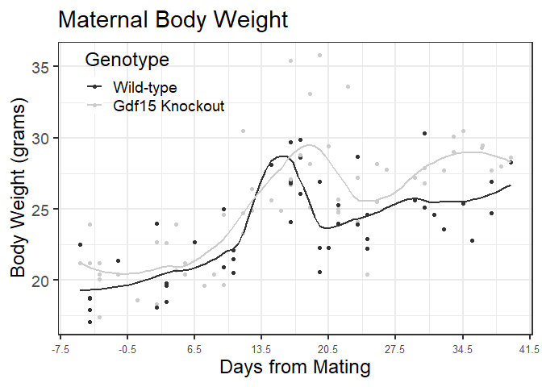
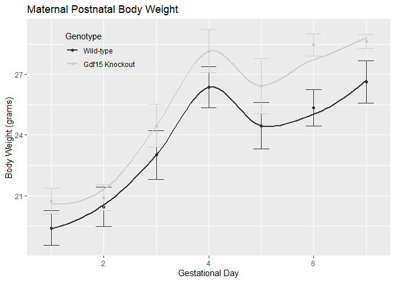
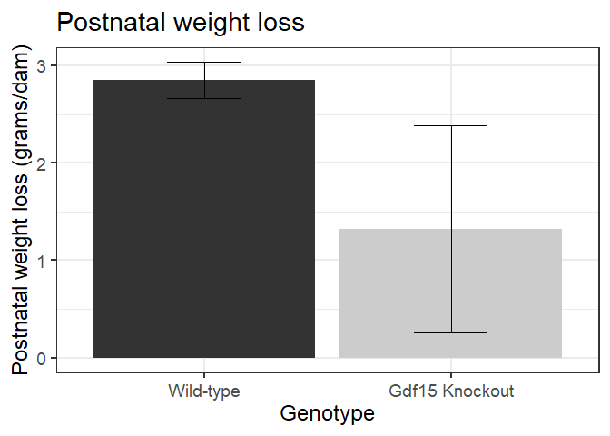

```r
#load commonly needed packages
library(processx)
library(devtools)
```

```
## Loading required package: usethis
```

```r
library(tidyr)
library(dplyr)
```

```
## 
## Attaching package: 'dplyr'
```

```
## The following objects are masked from 'package:stats':
## 
##     filter, lag
```

```
## The following objects are masked from 'package:base':
## 
##     intersect, setdiff, setequal, union
```

```r
library(readr)
library(ggplot2)
library(knitr)
library(car)
```

```
## Loading required package: carData
```

```
## 
## Attaching package: 'car'
```

```
## The following object is masked from 'package:dplyr':
## 
##     recode
```

```r
library(lme4)
```

```
## Loading required package: Matrix
```

```
## 
## Attaching package: 'Matrix'
```

```
## The following objects are masked from 'package:tidyr':
## 
##     expand, pack, unpack
```

```r
library(broom)
library(forcats)

#figures made will go to directory called figures, will make them as both png and pdf files 
opts_chunk$set(fig.path='figures/',
               echo=FALSE, warning=FALSE, message=FALSE,dev=c('png','pdf'))
options(scipen = 2, digits = 3)
# set echo and message to TRUE if you want to display code blocks and code output respectively
knitr::knit_hooks$set(inline = function(x) {
  knitr:::format_sci(x, 'md')
})
se <- function(x) sd(x, na.rm=T)/sqrt(length(x))

#set plot color scheme
color.scheme = c("#333333","#CCCCCC")
defense.color.scheme<- c("#00274C","#A5A508")
```


#Analysis

<!-- --><!-- -->

```
## List of 136
##  $ line                            :List of 6
##   ..$ colour       : chr "black"
##   ..$ linewidth    : num 0.818
##   ..$ linetype     : num 1
##   ..$ lineend      : chr "butt"
##   ..$ arrow        : logi FALSE
##   ..$ inherit.blank: logi TRUE
##   ..- attr(*, "class")= chr [1:2] "element_line" "element"
##  $ rect                            :List of 5
##   ..$ fill         : chr "white"
##   ..$ colour       : chr "black"
##   ..$ linewidth    : num 0.818
##   ..$ linetype     : num 1
##   ..$ inherit.blank: logi TRUE
##   ..- attr(*, "class")= chr [1:2] "element_rect" "element"
##  $ text                            :List of 11
##   ..$ family       : chr ""
##   ..$ face         : chr "plain"
##   ..$ colour       : chr "black"
##   ..$ size         : num 18
##   ..$ hjust        : num 0.5
##   ..$ vjust        : num 0.5
##   ..$ angle        : num 0
##   ..$ lineheight   : num 0.9
##   ..$ margin       : 'margin' num [1:4] 0points 0points 0points 0points
##   .. ..- attr(*, "unit")= int 8
##   ..$ debug        : logi FALSE
##   ..$ inherit.blank: logi TRUE
##   ..- attr(*, "class")= chr [1:2] "element_text" "element"
##  $ title                           : NULL
##  $ aspect.ratio                    : NULL
##  $ axis.title                      : NULL
##  $ axis.title.x                    :List of 11
##   ..$ family       : NULL
##   ..$ face         : NULL
##   ..$ colour       : NULL
##   ..$ size         : NULL
##   ..$ hjust        : NULL
##   ..$ vjust        : num 1
##   ..$ angle        : NULL
##   ..$ lineheight   : NULL
##   ..$ margin       : 'margin' num [1:4] 4.5points 0points 0points 0points
##   .. ..- attr(*, "unit")= int 8
##   ..$ debug        : NULL
##   ..$ inherit.blank: logi TRUE
##   ..- attr(*, "class")= chr [1:2] "element_text" "element"
##  $ axis.title.x.top                :List of 11
##   ..$ family       : NULL
##   ..$ face         : NULL
##   ..$ colour       : NULL
##   ..$ size         : NULL
##   ..$ hjust        : NULL
##   ..$ vjust        : num 0
##   ..$ angle        : NULL
##   ..$ lineheight   : NULL
##   ..$ margin       : 'margin' num [1:4] 0points 0points 4.5points 0points
##   .. ..- attr(*, "unit")= int 8
##   ..$ debug        : NULL
##   ..$ inherit.blank: logi TRUE
##   ..- attr(*, "class")= chr [1:2] "element_text" "element"
##  $ axis.title.x.bottom             : NULL
##  $ axis.title.y                    :List of 11
##   ..$ family       : NULL
##   ..$ face         : NULL
##   ..$ colour       : NULL
##   ..$ size         : NULL
##   ..$ hjust        : NULL
##   ..$ vjust        : num 1
##   ..$ angle        : num 90
##   ..$ lineheight   : NULL
##   ..$ margin       : 'margin' num [1:4] 0points 4.5points 0points 0points
##   .. ..- attr(*, "unit")= int 8
##   ..$ debug        : NULL
##   ..$ inherit.blank: logi TRUE
##   ..- attr(*, "class")= chr [1:2] "element_text" "element"
##  $ axis.title.y.left               : NULL
##  $ axis.title.y.right              :List of 11
##   ..$ family       : NULL
##   ..$ face         : NULL
##   ..$ colour       : NULL
##   ..$ size         : NULL
##   ..$ hjust        : NULL
##   ..$ vjust        : num 1
##   ..$ angle        : num -90
##   ..$ lineheight   : NULL
##   ..$ margin       : 'margin' num [1:4] 0points 0points 0points 4.5points
##   .. ..- attr(*, "unit")= int 8
##   ..$ debug        : NULL
##   ..$ inherit.blank: logi TRUE
##   ..- attr(*, "class")= chr [1:2] "element_text" "element"
##  $ axis.text                       :List of 11
##   ..$ family       : NULL
##   ..$ face         : NULL
##   ..$ colour       : chr "grey30"
##   ..$ size         : 'rel' num 0.8
##   ..$ hjust        : NULL
##   ..$ vjust        : NULL
##   ..$ angle        : NULL
##   ..$ lineheight   : NULL
##   ..$ margin       : NULL
##   ..$ debug        : NULL
##   ..$ inherit.blank: logi TRUE
##   ..- attr(*, "class")= chr [1:2] "element_text" "element"
##  $ axis.text.x                     :List of 11
##   ..$ family       : NULL
##   ..$ face         : NULL
##   ..$ colour       : NULL
##   ..$ size         : NULL
##   ..$ hjust        : NULL
##   ..$ vjust        : num 1
##   ..$ angle        : NULL
##   ..$ lineheight   : NULL
##   ..$ margin       : 'margin' num [1:4] 3.6points 0points 0points 0points
##   .. ..- attr(*, "unit")= int 8
##   ..$ debug        : NULL
##   ..$ inherit.blank: logi TRUE
##   ..- attr(*, "class")= chr [1:2] "element_text" "element"
##  $ axis.text.x.top                 :List of 11
##   ..$ family       : NULL
##   ..$ face         : NULL
##   ..$ colour       : NULL
##   ..$ size         : NULL
##   ..$ hjust        : NULL
##   ..$ vjust        : num 0
##   ..$ angle        : NULL
##   ..$ lineheight   : NULL
##   ..$ margin       : 'margin' num [1:4] 0points 0points 3.6points 0points
##   .. ..- attr(*, "unit")= int 8
##   ..$ debug        : NULL
##   ..$ inherit.blank: logi TRUE
##   ..- attr(*, "class")= chr [1:2] "element_text" "element"
##  $ axis.text.x.bottom              : NULL
##  $ axis.text.y                     :List of 11
##   ..$ family       : NULL
##   ..$ face         : NULL
##   ..$ colour       : NULL
##   ..$ size         : NULL
##   ..$ hjust        : num 1
##   ..$ vjust        : NULL
##   ..$ angle        : NULL
##   ..$ lineheight   : NULL
##   ..$ margin       : 'margin' num [1:4] 0points 3.6points 0points 0points
##   .. ..- attr(*, "unit")= int 8
##   ..$ debug        : NULL
##   ..$ inherit.blank: logi TRUE
##   ..- attr(*, "class")= chr [1:2] "element_text" "element"
##  $ axis.text.y.left                : NULL
##  $ axis.text.y.right               :List of 11
##   ..$ family       : NULL
##   ..$ face         : NULL
##   ..$ colour       : NULL
##   ..$ size         : NULL
##   ..$ hjust        : num 0
##   ..$ vjust        : NULL
##   ..$ angle        : NULL
##   ..$ lineheight   : NULL
##   ..$ margin       : 'margin' num [1:4] 0points 0points 0points 3.6points
##   .. ..- attr(*, "unit")= int 8
##   ..$ debug        : NULL
##   ..$ inherit.blank: logi TRUE
##   ..- attr(*, "class")= chr [1:2] "element_text" "element"
##  $ axis.text.theta                 : NULL
##  $ axis.text.r                     :List of 11
##   ..$ family       : NULL
##   ..$ face         : NULL
##   ..$ colour       : NULL
##   ..$ size         : NULL
##   ..$ hjust        : num 0.5
##   ..$ vjust        : NULL
##   ..$ angle        : NULL
##   ..$ lineheight   : NULL
##   ..$ margin       : 'margin' num [1:4] 0points 3.6points 0points 3.6points
##   .. ..- attr(*, "unit")= int 8
##   ..$ debug        : NULL
##   ..$ inherit.blank: logi TRUE
##   ..- attr(*, "class")= chr [1:2] "element_text" "element"
##  $ axis.ticks                      :List of 6
##   ..$ colour       : chr "grey20"
##   ..$ linewidth    : NULL
##   ..$ linetype     : NULL
##   ..$ lineend      : NULL
##   ..$ arrow        : logi FALSE
##   ..$ inherit.blank: logi TRUE
##   ..- attr(*, "class")= chr [1:2] "element_line" "element"
##  $ axis.ticks.x                    : NULL
##  $ axis.ticks.x.top                : NULL
##  $ axis.ticks.x.bottom             : NULL
##  $ axis.ticks.y                    : NULL
##  $ axis.ticks.y.left               : NULL
##  $ axis.ticks.y.right              : NULL
##  $ axis.ticks.theta                : NULL
##  $ axis.ticks.r                    : NULL
##  $ axis.minor.ticks.x.top          : NULL
##  $ axis.minor.ticks.x.bottom       : NULL
##  $ axis.minor.ticks.y.left         : NULL
##  $ axis.minor.ticks.y.right        : NULL
##  $ axis.minor.ticks.theta          : NULL
##  $ axis.minor.ticks.r              : NULL
##  $ axis.ticks.length               : 'simpleUnit' num 4.5points
##   ..- attr(*, "unit")= int 8
##  $ axis.ticks.length.x             : NULL
##  $ axis.ticks.length.x.top         : NULL
##  $ axis.ticks.length.x.bottom      : NULL
##  $ axis.ticks.length.y             : NULL
##  $ axis.ticks.length.y.left        : NULL
##  $ axis.ticks.length.y.right       : NULL
##  $ axis.ticks.length.theta         : NULL
##  $ axis.ticks.length.r             : NULL
##  $ axis.minor.ticks.length         : 'rel' num 0.75
##  $ axis.minor.ticks.length.x       : NULL
##  $ axis.minor.ticks.length.x.top   : NULL
##  $ axis.minor.ticks.length.x.bottom: NULL
##  $ axis.minor.ticks.length.y       : NULL
##  $ axis.minor.ticks.length.y.left  : NULL
##  $ axis.minor.ticks.length.y.right : NULL
##  $ axis.minor.ticks.length.theta   : NULL
##  $ axis.minor.ticks.length.r       : NULL
##  $ axis.line                       : list()
##   ..- attr(*, "class")= chr [1:2] "element_blank" "element"
##  $ axis.line.x                     : NULL
##  $ axis.line.x.top                 : NULL
##  $ axis.line.x.bottom              : NULL
##  $ axis.line.y                     : NULL
##  $ axis.line.y.left                : NULL
##  $ axis.line.y.right               : NULL
##  $ axis.line.theta                 : NULL
##  $ axis.line.r                     : NULL
##  $ legend.background               :List of 5
##   ..$ fill         : NULL
##   ..$ colour       : logi NA
##   ..$ linewidth    : NULL
##   ..$ linetype     : NULL
##   ..$ inherit.blank: logi TRUE
##   ..- attr(*, "class")= chr [1:2] "element_rect" "element"
##  $ legend.margin                   : 'margin' num [1:4] 9points 9points 9points 9points
##   ..- attr(*, "unit")= int 8
##  $ legend.spacing                  : 'simpleUnit' num 18points
##   ..- attr(*, "unit")= int 8
##  $ legend.spacing.x                : NULL
##  $ legend.spacing.y                : NULL
##  $ legend.key                      : NULL
##  $ legend.key.size                 : 'simpleUnit' num 1.2lines
##   ..- attr(*, "unit")= int 3
##  $ legend.key.height               : NULL
##  $ legend.key.width                : NULL
##  $ legend.key.spacing              : 'simpleUnit' num 9points
##   ..- attr(*, "unit")= int 8
##  $ legend.key.spacing.x            : NULL
##  $ legend.key.spacing.y            : NULL
##  $ legend.frame                    : NULL
##  $ legend.ticks                    : NULL
##  $ legend.ticks.length             : 'rel' num 0.2
##  $ legend.axis.line                : NULL
##  $ legend.text                     :List of 11
##   ..$ family       : NULL
##   ..$ face         : NULL
##   ..$ colour       : NULL
##   ..$ size         : 'rel' num 0.8
##   ..$ hjust        : NULL
##   ..$ vjust        : NULL
##   ..$ angle        : NULL
##   ..$ lineheight   : NULL
##   ..$ margin       : NULL
##   ..$ debug        : NULL
##   ..$ inherit.blank: logi TRUE
##   ..- attr(*, "class")= chr [1:2] "element_text" "element"
##  $ legend.text.position            : NULL
##  $ legend.title                    :List of 11
##   ..$ family       : NULL
##   ..$ face         : NULL
##   ..$ colour       : NULL
##   ..$ size         : NULL
##   ..$ hjust        : num 0
##   ..$ vjust        : NULL
##   ..$ angle        : NULL
##   ..$ lineheight   : NULL
##   ..$ margin       : NULL
##   ..$ debug        : NULL
##   ..$ inherit.blank: logi TRUE
##   ..- attr(*, "class")= chr [1:2] "element_text" "element"
##  $ legend.title.position           : NULL
##  $ legend.position                 : chr "right"
##  $ legend.position.inside          : NULL
##  $ legend.direction                : NULL
##  $ legend.byrow                    : NULL
##  $ legend.justification            : chr "center"
##  $ legend.justification.top        : NULL
##  $ legend.justification.bottom     : NULL
##  $ legend.justification.left       : NULL
##  $ legend.justification.right      : NULL
##  $ legend.justification.inside     : NULL
##  $ legend.location                 : NULL
##  $ legend.box                      : NULL
##  $ legend.box.just                 : NULL
##  $ legend.box.margin               : 'margin' num [1:4] 0cm 0cm 0cm 0cm
##   ..- attr(*, "unit")= int 1
##  $ legend.box.background           : list()
##   ..- attr(*, "class")= chr [1:2] "element_blank" "element"
##  $ legend.box.spacing              : 'simpleUnit' num 18points
##   ..- attr(*, "unit")= int 8
##   [list output truncated]
##  - attr(*, "class")= chr [1:2] "theme" "gg"
##  - attr(*, "complete")= logi TRUE
##  - attr(*, "validate")= logi TRUE
```
<!-- -->

```
## 
## 	Shapiro-Wilk normality test
## 
## data:  prenatal.bw.data.cleaned$gwg[prenatal.bw.data.cleaned$Genotype == "Wild-type"]
## W = 0.9, p-value = 0.5
```

```
## 
## 	Shapiro-Wilk normality test
## 
## data:  prenatal.bw.data.cleaned$gwg[prenatal.bw.data.cleaned$Genotype == "GDF15 Knockout"]
## W = 0.9, p-value = 0.3
```

```
## Levene's Test for Homogeneity of Variance (center = median)
##       Df F value Pr(>F)
## group  1     1.4   0.26
##       12
```

```
## 
## 	Welch Two Sample t-test
## 
## data:  gwg by Genotype
## t = -0.03, df = 12, p-value = 1
## alternative hypothesis: true difference in means between group Wild-type and group GDF15 Knockout is not equal to 0
## 95 percent confidence interval:
##  -3.71  3.61
## sample estimates:
##      mean in group Wild-type mean in group GDF15 Knockout 
##                         9.55                         9.60
```

<!-- -->

```
## 
## 	Shapiro-Wilk normality test
## 
## data:  postnatal.bw.data.cleaned$loss[postnatal.bw.data.cleaned$Genotype == "GDF15 Knockout"]
## W = 0.9, p-value = 0.1
```

```
## 
## 	Shapiro-Wilk normality test
## 
## data:  postnatal.bw.data.cleaned$loss[postnatal.bw.data.cleaned$Genotype == "Wild-type"]
## W = 0.9, p-value = 0.4
```

```
## Levene's Test for Homogeneity of Variance (center = median)
##       Df F value Pr(>F)
## group  1    2.95   0.11
##       12
```

```
## 
## 	Welch Two Sample t-test
## 
## data:  loss by Genotype
## t = 1, df = 7, p-value = 0.2
## alternative hypothesis: true difference in means between group Wild-type and group GDF15 Knockout is not equal to 0
## 95 percent confidence interval:
##  -0.998  4.048
## sample estimates:
##      mean in group Wild-type mean in group GDF15 Knockout 
##                         2.85                         1.32
```


```
## Data: bw.data.pre
## Models:
## base.model: gram.values ~ 1 + (1 | MouseID)
## time.model: gram.values ~ gest.age + (1 | MouseID)
##            npar AIC BIC logLik deviance Chisq Df Pr(>Chisq)    
## base.model    3 358 364   -176      352                        
## time.model    4 299 307   -145      291    61  1    5.8e-15 ***
## ---
## Signif. codes:  0 '***' 0.001 '**' 0.01 '*' 0.05 '.' 0.1 ' ' 1
```

```
## Data: bw.data.pre
## Models:
## time.model: gram.values ~ gest.age + (1 | MouseID)
## geno.model: gram.values ~ gest.age + Genotype + (1 | MouseID)
##            npar AIC BIC logLik deviance Chisq Df Pr(>Chisq)
## time.model    4 299 307   -145      291                    
## geno.model    5 300 310   -145      290  0.61  1       0.44
```

```
## Data: bw.data.pre
## Models:
## geno.model: gram.values ~ gest.age + Genotype + (1 | MouseID)
## geno.int.model: gram.values ~ gest.age * Genotype + (1 | MouseID)
##                npar AIC BIC logLik deviance Chisq Df Pr(>Chisq)
## geno.model        5 300 310   -145      290                    
## geno.int.model    6 302 314   -145      290  0.19  1       0.66
```

```
## Analysis of Deviance Table (Type II Wald chisquare tests)
## 
## Response: gram.values
##                    Chisq Df Pr(>Chisq)    
## gest.age          131.67  1     <2e-16 ***
## Genotype            0.53  1       0.47    
## gest.age:Genotype   0.18  1       0.67    
## ---
## Signif. codes:  0 '***' 0.001 '**' 0.01 '*' 0.05 '.' 0.1 ' ' 1
```

```
##            (Intercept)               gest.age GenotypeGDF15 Knockout 
##                 19.912                  0.437                  0.965
```

```
## Analysis of Deviance Table (Type II Wald chisquare tests)
## 
## Response: gram.values
##           Chisq Df Pr(>Chisq)    
## gest.age 134.24  1     <2e-16 ***
## Genotype   0.53  1       0.47    
## ---
## Signif. codes:  0 '***' 0.001 '**' 0.01 '*' 0.05 '.' 0.1 ' ' 1
```

```
## Data: bw.data.post
## Models:
## base.post: gram.values ~ 1 + (1 | MouseID)
## time.post: gram.values ~ gest.age + (1 | MouseID)
##           npar AIC BIC logLik deviance Chisq Df Pr(>Chisq)    
## base.post    3 220 225 -106.7      214                        
## time.post    4 204 212  -98.2      196  17.1  1   0.000036 ***
## ---
## Signif. codes:  0 '***' 0.001 '**' 0.01 '*' 0.05 '.' 0.1 ' ' 1
```

```
## Data: bw.data.post
## Models:
## time.post: gram.values ~ gest.age + (1 | MouseID)
## geno.post: gram.values ~ gest.age + Genotype + (1 | MouseID)
##           npar AIC BIC logLik deviance Chisq Df Pr(>Chisq)
## time.post    4 204 212  -98.2      196                    
## geno.post    5 205 214  -97.3      195  1.81  1       0.18
```

```
## Data: bw.data.post
## Models:
## geno.post: gram.values ~ gest.age + Genotype + (1 | MouseID)
## geno.int.post: gram.values ~ gest.age * Genotype + (1 | MouseID)
##               npar AIC BIC logLik deviance Chisq Df Pr(>Chisq)
## geno.post        5 205 214  -97.3      195                    
## geno.int.post    6 206 218  -97.2      194  0.12  1       0.73
```

```
## Analysis of Deviance Table (Type II Wald chisquare tests)
## 
## Response: gram.values
##                   Chisq Df Pr(>Chisq)    
## gest.age          21.14  1  0.0000043 ***
## Genotype           1.64  1       0.20    
## gest.age:Genotype  0.13  1       0.72    
## ---
## Signif. codes:  0 '***' 0.001 '**' 0.01 '*' 0.05 '.' 0.1 ' ' 1
```

```
##            (Intercept)               gest.age GenotypeGDF15 Knockout 
##                 20.538                  0.161                  1.621
```

```
## Analysis of Deviance Table (Type II Wald chisquare tests)
## 
## Response: gram.values
##          Chisq Df Pr(>Chisq)    
## gest.age 21.63  1  0.0000033 ***
## Genotype  1.65  1        0.2    
## ---
## Signif. codes:  0 '***' 0.001 '**' 0.01 '*' 0.05 '.' 0.1 ' ' 1
```


```
##  Difference between Two means 
##  (Independent Samples t Test) 
##  H0: mu1 = mu2 
##  HA: mu1 != mu2 
##  ------------------------------ 
##   Statistical power = 0.145 
##   n1 = 6 
##   n2 = 6 
##  ------------------------------ 
##  Alternative = "not equal" 
##  Degrees of freedom = 10 
##  Non-centrality parameter = 0.982 
##  Type I error rate = 0.05 
##  Type II error rate = 0.855
```

```
## 
##      Two-sample t test power calculation 
## 
##               n = 6
##               d = 0.716
##       sig.level = 0.05
##           power = 0.203
##     alternative = two.sided
## 
## NOTE: n is number in *each* group
```
