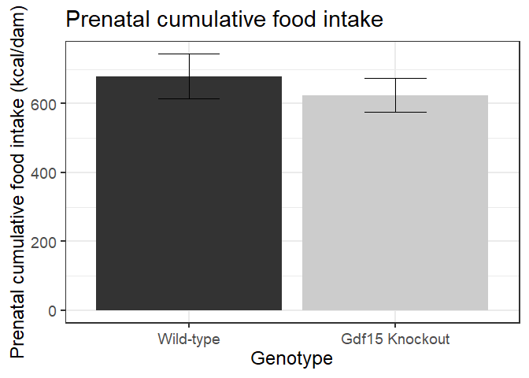
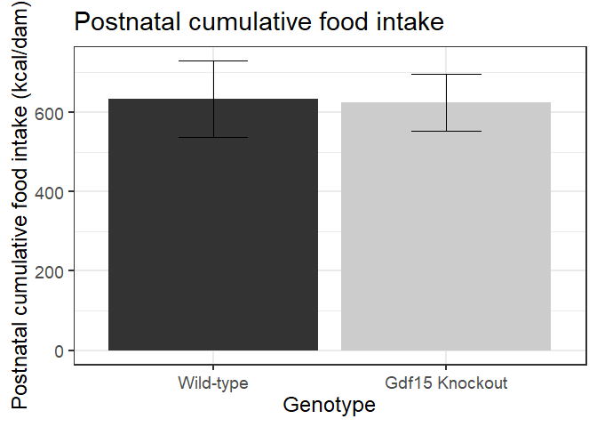
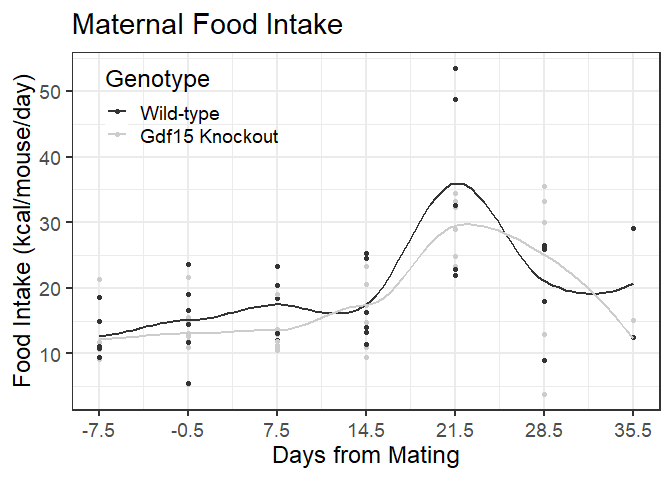
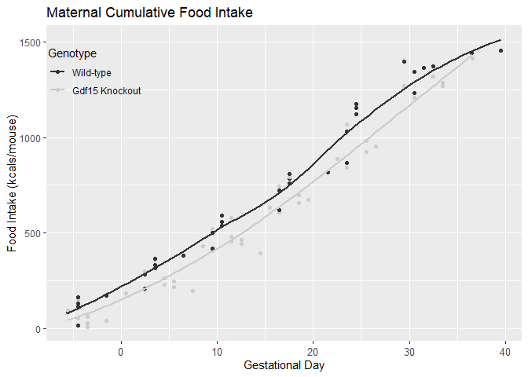

```r
#load commonly needed packages
library(processx)
library(devtools)
```

```
## Loading required package: usethis
```

```r
library(tidyr)
library(dplyr)
```

```
## 
## Attaching package: 'dplyr'
```

```
## The following objects are masked from 'package:stats':
## 
##     filter, lag
```

```
## The following objects are masked from 'package:base':
## 
##     intersect, setdiff, setequal, union
```

```r
library(readr)
library(ggplot2)
library(knitr)
library(car)
```

```
## Loading required package: carData
```

```
## 
## Attaching package: 'car'
```

```
## The following object is masked from 'package:dplyr':
## 
##     recode
```

```r
library(lme4)
```

```
## Loading required package: Matrix
```

```
## 
## Attaching package: 'Matrix'
```

```
## The following objects are masked from 'package:tidyr':
## 
##     expand, pack, unpack
```

```r
library(broom)
library(forcats)

#figures made will go to directory called figures, will make them as both png and pdf files 
opts_chunk$set(fig.path='figures/',
               echo=FALSE, warning=FALSE, message=FALSE,dev=c('png','pdf'))
options(scipen = 2, digits = 3)
# set echo and message to TRUE if you want to display code blocks and code output respectively
knitr::knit_hooks$set(inline = function(x) {
  knitr:::format_sci(x, 'md')
})
se <- function(x) sd(x, na.rm=T)/sqrt(length(x))

#set plot color scheme
color.scheme = c("#333333","#CCCCCC")
#defense.color.scheme<- c("#00274C","#A5A508")
```

#data entry


<!-- -->

```
## 
## 	Shapiro-Wilk normality test
## 
## data:  prenatal.final$final.pre[prenatal.final$Genotype == "-/-"]
## W = 0.9, p-value = 0.5
```

```
## 
## 	Shapiro-Wilk normality test
## 
## data:  prenatal.final$final.pre[prenatal.final$Genotype == "+/+"]
## W = 0.8, p-value = 0.08
```

```
## Levene's Test for Homogeneity of Variance (center = median)
##       Df F value Pr(>F)
## group  1       0   0.98
##       12
```

```
## [1] 0.516
```


<!-- -->

```
## 
## 	Shapiro-Wilk normality test
## 
## data:  sub.post$postnatal.final[sub.post$Genotype == "+/+"]
## W = 0.8, p-value = 0.1
```

```
## 
## 	Shapiro-Wilk normality test
## 
## data:  sub.post$postnatal.final[sub.post$Genotype == "-/-"]
## W = 0.9, p-value = 0.3
```

```
## Levene's Test for Homogeneity of Variance (center = median)
##       Df F value Pr(>F)
## group  1    0.05   0.83
##       10
```

```
## [1] 0.939
```
 
<!-- --><!-- -->


```{ stats}
#pre birth
##daily kcals
pre.birth.intake<-intake.data.cleaned%>%
  filter(postnatal == "n")#filter for only pre-birth observations
daily.null<-lmer(kcals.consumed ~ 1 + (1|MouseID), data = pre.birth.intake)
daily.day<-lmer(kcals.consumed ~ as.factor(gest.age) + (1|MouseID), pre.birth.intake)
anova(daily.null, daily.day) #significant effect of gestational age
daily.geno<-lmer(kcals.consumed ~ gest.age + Genotype +(1|MouseID), pre.birth.intake)
anova(daily.day, daily.geno)#no significant effect for genotype
daily.geno.int<-lmer(kcals.consumed ~ gest.age*Genotype + (1|MouseID), pre.birth.intake)
anova(daily.geno, daily.geno.int)
Anova(daily.geno.int)# No interaction effect 
Anova(daily.geno)
fixef(daily.geno)

#cumulative kcals
cumu.null<-lmer(food.cumulative ~1 + (1|MouseID), data = pre.birth.intake)
cumu.day<-lmer(food.cumulative ~gest.age + (1|MouseID), data = pre.birth.intake)
anova(cumu.null, cumu.day)#sig effect of day
cumu.geno <- lmer(food.cumulative ~gest.age + Genotype + (1|MouseID), data = pre.birth.intake)
anova(cumu.day, cumu.geno)#sig efect of geno
cumu.geno.int <- lmer(food.cumulative ~gest.age*Genotype + (1|MouseID), data = pre.birth.intake)
anova(cumu.geno, cumu.geno.int)#no interaction
Anova(cumu.geno.int)# no interaction present, use simple model 
Anova(cumu.geno)
fixef(cumu.geno)


#post models
 post.birth.intake<-intake.data.cleaned%>%
  filter(postnatal=="y")
#daily kcals
post.null<-lmer(kcals.consumed ~ 1 + (1|MouseID), data = post.birth.intake)
daily.post<-lmer(kcals.consumed ~ gest.age + (1|MouseID), data = post.birth.intake)
anova(post.null, daily.post)#sig effect of day
geno.post<-lmer(kcals.consumed ~ gest.age + Genotype + (1|MouseID), data = post.birth.intake)
anova(daily.post, geno.post)#no significant difference between models
geno.post.int<-lmer(kcals.consumed ~ gest.age*Genotype + (1|MouseID), data = post.birth.intake)
anova(geno.post, geno.post.int)
Anova(geno.post.int)#no effect of interaction
Anova(geno.post)
fixef(geno.post)

#cumulative kcals
post.cumu.null<-lmer(food.cumulative ~ 1 + (1|MouseID), data = post.birth.intake)
daily.cumu.post<-lmer(food.cumulative ~ gest.age + (1|MouseID), data = post.birth.intake)
anova(post.cumu.null, daily.cumu.post)#significant effect of gestational age
geno.cumu.post<-lmer(food.cumulative ~ gest.age + Genotype + (1|MouseID), data = post.birth.intake)
anova(daily.cumu.post, geno.cumu.post)#significant difference between models
geno.int.cumu.post<-lmer(food.cumulative ~ gest.age*Genotype + (1|MouseID), data = post.birth.intake)
anova(geno.cumu.post, geno.int.cumu.post)#no differences between models
Anova(geno.int.cumu.post)#No interaction effect present, continue with simple genotype model
Anova(geno.cumu.post)
fixef(geno.cumu.post)
``
