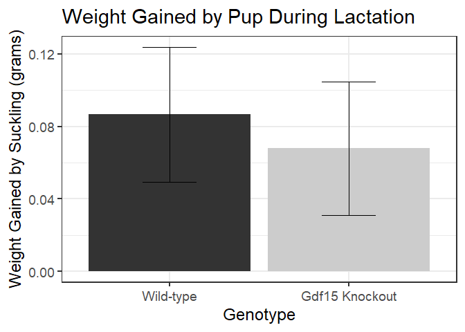
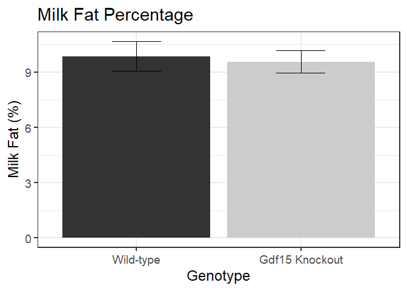

<!-- -->

```
## 
## 	Shapiro-Wilk normality test
## 
## data:  milk.weights$Dam.Lost.Weight.norm[milk.weights$Genotype == "Wild-type"]
## W = 0.9, p-value = 0.7
```

```
## 
## 	Shapiro-Wilk normality test
## 
## data:  milk.weights$Dam.Lost.Weight.norm[milk.weights$Genotype == "Gdf15 Knockout"]
## W = 0.9, p-value = 0.4
```

```
## Levene's Test for Homogeneity of Variance (center = median)
##       Df F value Pr(>F)
## group  1    0.59   0.46
##       10
```

```
## 
## 	Welch Two Sample t-test
## 
## data:  Dam.Lost.Weight.norm by Genotype
## t = 0.4, df = 8, p-value = 0.7
## alternative hypothesis: true difference in means between group Wild-type and group Gdf15 Knockout is not equal to 0
## 95 percent confidence interval:
##  -0.161  0.219
## sample estimates:
##      mean in group Wild-type mean in group Gdf15 Knockout 
##                        0.188                        0.158
```

<!-- -->

```
## 
## 	Shapiro-Wilk normality test
## 
## data:  milk.weights$Pup.Gained.Weight.norm[milk.weights$Genotype == "Wild-type"]
## W = 0.8, p-value = 0.04
```

```
## 
## 	Shapiro-Wilk normality test
## 
## data:  milk.weights$Pup.Gained.Weight.norm[milk.weights$Genotype == "Gdf15 Knockout"]
## W = 0.9, p-value = 0.2
```

```
## 
## 	Wilcoxon rank sum test with continuity correction
## 
## data:  Pup.Gained.Weight.norm by Genotype
## W = 20, p-value = 0.7
## alternative hypothesis: true location shift is not equal to 0
```


<!-- -->

```
## 
## 	Shapiro-Wilk normality test
## 
## data:  milk.stats$avg.milkfat[milk.stats$Genotype == "Wild-type"]
## W = 0.9, p-value = 0.6
```

```
## 
## 	Shapiro-Wilk normality test
## 
## data:  milk.stats$avg.milkfat[milk.stats$Genotype == "Gdf15 Knockout"]
## W = 0.9, p-value = 0.4
```

```
## Levene's Test for Homogeneity of Variance (center = median)
##       Df F value Pr(>F)
## group  1    0.11   0.75
##       10
```

```
## 
## 	Welch Two Sample t-test
## 
## data:  avg.milkfat by Genotype
## t = 0.09, df = 10, p-value = 0.9
## alternative hypothesis: true difference in means between group Wild-type and group Gdf15 Knockout is not equal to 0
## 95 percent confidence interval:
##  -3.61  3.92
## sample estimates:
##      mean in group Wild-type mean in group Gdf15 Knockout 
##                         9.88                         9.72
```
