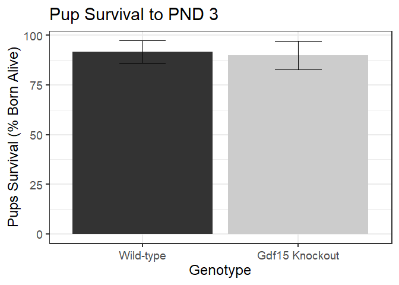
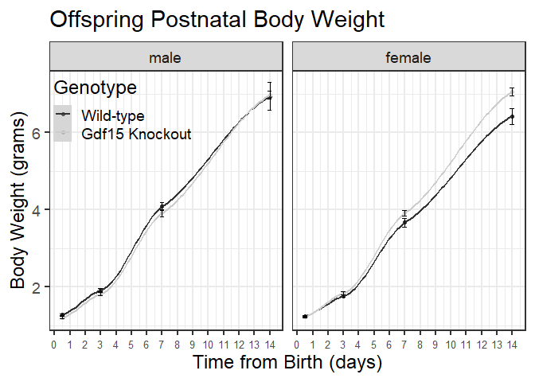

<!-- -->

```
## 
## 	Shapiro-Wilk normality test
## 
## data:  birth.weight.stats$birth.weight[birth.weight.stats$Genotype == "GDF15 Knockout"]
## W = 1, p-value = 0.8
```

```
## 
## 	Shapiro-Wilk normality test
## 
## data:  birth.weight.stats$birth.weight[birth.weight.stats$Genotype == "Wild-type"]
## W = 1, p-value = 0.3
```

```
## Levene's Test for Homogeneity of Variance (center = median)
##       Df F value Pr(>F)
## group  1    0.04   0.85
##       78
```

```
## 
## 	Welch Two Sample t-test
## 
## data:  birth.weight by Genotype
## t = 2, df = 77, p-value = 0.05
## alternative hypothesis: true difference in means between group Wild-type and group GDF15 Knockout is not equal to 0
## 95 percent confidence interval:
##  0.00000414 0.07913727
## sample estimates:
##      mean in group Wild-type mean in group GDF15 Knockout 
##                         1.26                         1.22
```


<!-- -->

```
## 
## 	Shapiro-Wilk normality test
## 
## data:  GA.stat$gest.age[GA.stat$Genotype == "GDF15 Knockout"]
## W = 0.7, p-value = 0.005
```

```
## 
## 	Shapiro-Wilk normality test
## 
## data:  GA.stat$gest.age[GA.stat$Genotype == "Wild-type"]
## W = 0.8, p-value = 0.03
```

```
## Levene's Test for Homogeneity of Variance (center = median)
##       Df F value Pr(>F)
## group  1    0.07   0.79
##       11
```

```
## 
## 	Wilcoxon rank sum test with continuity correction
## 
## data:  gest.age by Genotype
## W = 18, p-value = 0.8
## alternative hypothesis: true location shift is not equal to 0
```


<!-- -->

```
## 
## 	Shapiro-Wilk normality test
## 
## data:  litter.size.data$total.pups[litter.size.data$Genotype == "GDF15 Knockout"]
## W = 0.8, p-value = 0.07
```

```
## 
## 	Shapiro-Wilk normality test
## 
## data:  litter.size.data$total.pups[litter.size.data$Genotype == "Wild-type"]
## W = 0.9, p-value = 0.4
```

```
## Levene's Test for Homogeneity of Variance (center = median)
##       Df F value Pr(>F)
## group  1    0.15   0.71
##       11
```

```
## 
## 	Welch Two Sample t-test
## 
## data:  total.pups by Genotype
## t = -2, df = 10, p-value = 0.2
## alternative hypothesis: true difference in means between group Wild-type and group GDF15 Knockout is not equal to 0
## 95 percent confidence interval:
##  -3.873  0.683
## sample estimates:
##      mean in group Wild-type mean in group GDF15 Knockout 
##                         5.83                         7.43
```

<!-- -->

```
## 
## 	Shapiro-Wilk normality test
## 
## data:  litter.size.data$living.pups[litter.size.data$Genotype == "GDF15 Knockout"]
## W = 0.9, p-value = 0.2
```

```
## 
## 	Shapiro-Wilk normality test
## 
## data:  litter.size.data$living.pups[litter.size.data$Genotype == "Wild-type"]
## W = 0.9, p-value = 0.4
```

```
## Levene's Test for Homogeneity of Variance (center = median)
##       Df F value Pr(>F)
## group  1    0.58   0.46
##       11
```

```
## 
## 	Welch Two Sample t-test
## 
## data:  living.pups by Genotype
## t = -0.4, df = 11, p-value = 0.7
## alternative hypothesis: true difference in means between group Wild-type and group GDF15 Knockout is not equal to 0
## 95 percent confidence interval:
##  -2.94  2.04
## sample estimates:
##      mean in group Wild-type mean in group GDF15 Knockout 
##                         5.83                         6.29
```


<!-- -->

```
## 
## 	Shapiro-Wilk normality test
## 
## data:  litter.size.data$latency[litter.size.data$Genotype == "GDF15 Knockout"]
## W = 0.9, p-value = 0.4
```

```
## 
## 	Shapiro-Wilk normality test
## 
## data:  litter.size.data$latency[litter.size.data$Genotype == "Wild-type"]
## W = 0.9, p-value = 0.3
```

```
## Levene's Test for Homogeneity of Variance (center = median)
##       Df F value Pr(>F)
## group  1    0.83   0.38
##       11
```

```
## 
## 	Welch Two Sample t-test
## 
## data:  latency by Genotype
## t = -0.3, df = 9, p-value = 0.7
## alternative hypothesis: true difference in means between group Wild-type and group GDF15 Knockout is not equal to 0
## 95 percent confidence interval:
##  -2.16  1.59
## sample estimates:
##      mean in group Wild-type mean in group GDF15 Knockout 
##                         3.00                         3.29
```


<!-- -->

```
## 
## 	Shapiro-Wilk normality test
## 
## data:  mutated.litter.data$percent.survival[mutated.litter.data$Genotype == "GDF15 Knockout"]
## W = 0.6, p-value = 0.0006
```

```
## 
## 	Shapiro-Wilk normality test
## 
## data:  mutated.litter.data$percent.survival[mutated.litter.data$Genotype == "Wild-type"]
## W = 0.7, p-value = 0.006
```

```
## Levene's Test for Homogeneity of Variance (center = median)
##       Df F value Pr(>F)
## group  1    0.03   0.86
##       11
```

```
## 
## 	Wilcoxon rank sum test with continuity correction
## 
## data:  percent.survival by Genotype
## W = 21, p-value = 1
## alternative hypothesis: true location shift is not equal to 0
```


<!-- -->

```
## Data: full.sex.data
## Models:
## null.lme: weight ~ 1 + (1 | MouseID) + ((1 | pup.number) + (0 + day | pup.number)) + (1 | pup.number) + ((1 | MouseID) + (0 + day | MouseID))
## day.lme: weight ~ day + (1 | MouseID) + ((1 | pup.number) + (0 + day | pup.number)) + (1 | pup.number) + ((1 | MouseID) + (0 + day | MouseID))
##          npar AIC BIC logLik deviance Chisq Df Pr(>Chisq)    
## null.lme    8 169 197  -76.7    153.4                        
## day.lme     9 115 146  -48.6     97.3  56.1  1    6.8e-14 ***
## ---
## Signif. codes:  0 '***' 0.001 '**' 0.01 '*' 0.05 '.' 0.1 ' ' 1
```

```
## Linear mixed model fit by REML ['lmerMod']
## Formula: weight ~ day + (1 | MouseID) + ((1 | pup.number) + (0 + day |  
##     pup.number)) + (1 | pup.number) + ((1 | MouseID) + (0 + day |  
##     MouseID))
##    Data: full.sex.data
## 
## REML criterion at convergence: 109
## 
## Scaled residuals: 
##    Min     1Q Median     3Q    Max 
## -2.575 -0.844  0.267  0.738  2.399 
## 
## Random effects:
##  Groups       Name        Variance Std.Dev.  
##  pup.number   (Intercept) 0.00e+00 0.00000000
##  pup.number.1 day         8.80e-06 0.00296600
##  pup.number.2 (Intercept) 3.40e-11 0.00000583
##  MouseID      day         2.03e-03 0.04503578
##  MouseID.1    (Intercept) 3.51e-03 0.05928665
##  MouseID.2    (Intercept) 2.50e-05 0.00500351
##  Residual                 7.39e-02 0.27191021
## Number of obs: 232, groups:  pup.number, 79; MouseID, 13
## 
## Fixed effects:
##             Estimate Std. Error t value
## (Intercept)   0.8457     0.0309    27.4
## day           0.4220     0.0135    31.2
## 
## Correlation of Fixed Effects:
##     (Intr)
## day -0.173
## optimizer (nloptwrap) convergence code: 0 (OK)
## boundary (singular) fit: see help('isSingular')
```

```
## Data: full.sex.data
## Models:
## day.lme: weight ~ day + (1 | MouseID) + ((1 | pup.number) + (0 + day | pup.number)) + (1 | pup.number) + ((1 | MouseID) + (0 + day | MouseID))
## sex.lme: weight ~ day + sex + (1 | MouseID) + ((1 | pup.number) + (0 + day | pup.number)) + (1 | pup.number) + ((1 | MouseID) + (0 + day | MouseID))
##         npar AIC BIC logLik deviance Chisq Df Pr(>Chisq)
## day.lme    9 115 146  -48.6     97.3                    
## sex.lme   10 115 150  -47.7     95.4  1.91  1       0.17
```

```
## Linear mixed model fit by REML ['lmerMod']
## Formula: weight ~ day + sex + (1 | MouseID) + ((1 | pup.number) + (0 +  
##     day | pup.number)) + (1 | pup.number) + ((1 | MouseID) +  
##     (0 + day | MouseID))
##    Data: full.sex.data
## 
## REML criterion at convergence: 112
## 
## Scaled residuals: 
##    Min     1Q Median     3Q    Max 
## -2.688 -0.851  0.255  0.758  2.518 
## 
## Random effects:
##  Groups       Name        Variance Std.Dev. 
##  pup.number   (Intercept) 0.00e+00 0.0000000
##  pup.number.1 day         4.01e-09 0.0000633
##  pup.number.2 (Intercept) 0.00e+00 0.0000000
##  MouseID      day         2.01e-03 0.0447934
##  MouseID.1    (Intercept) 2.25e-10 0.0000150
##  MouseID.2    (Intercept) 3.95e-03 0.0628849
##  Residual                 7.39e-02 0.2717894
## Number of obs: 232, groups:  pup.number, 79; MouseID, 13
## 
## Fixed effects:
##             Estimate Std. Error t value
## (Intercept)   0.8744     0.0375    23.3
## day           0.4222     0.0135    31.4
## sexfemale    -0.0532     0.0381    -1.4
## 
## Correlation of Fixed Effects:
##           (Intr) day   
## day       -0.139       
## sexfemale -0.544 -0.008
## optimizer (nloptwrap) convergence code: 0 (OK)
## boundary (singular) fit: see help('isSingular')
```

```
## Data: full.sex.data
## Models:
## sex.lme: weight ~ day + sex + (1 | MouseID) + ((1 | pup.number) + (0 + day | pup.number)) + (1 | pup.number) + ((1 | MouseID) + (0 + day | MouseID))
## geno.lme: weight ~ day + sex + Genotype + (1 | MouseID) + ((1 | pup.number) + (0 + day | pup.number)) + (1 | pup.number) + ((1 | MouseID) + (0 + day | MouseID))
##          npar AIC BIC logLik deviance Chisq Df Pr(>Chisq)
## sex.lme    10 115 150  -47.7     95.4                    
## geno.lme   11 117 155  -47.7     95.3  0.07  1       0.79
```

```
## Linear mixed model fit by REML ['lmerMod']
## Formula: weight ~ day + sex + Genotype + (1 | MouseID) + ((1 | pup.number) +  
##     (0 + day | pup.number)) + (1 | pup.number) + ((1 | MouseID) +  
##     (0 + day | MouseID))
##    Data: full.sex.data
## 
## REML criterion at convergence: 116
## 
## Scaled residuals: 
##    Min     1Q Median     3Q    Max 
## -2.698 -0.844  0.268  0.758  2.506 
## 
## Random effects:
##  Groups       Name        Variance Std.Dev.  
##  pup.number   (Intercept) 0.00e+00 0.00000000
##  pup.number.1 day         1.58e-07 0.00039787
##  pup.number.2 (Intercept) 1.43e-11 0.00000378
##  MouseID      day         2.05e-03 0.04530244
##  MouseID.1    (Intercept) 2.87e-06 0.00169410
##  MouseID.2    (Intercept) 4.91e-03 0.07004201
##  Residual                 7.38e-02 0.27169177
## Number of obs: 232, groups:  pup.number, 79; MouseID, 13
## 
## Fixed effects:
##             Estimate Std. Error t value
## (Intercept)   0.8840     0.0517   17.10
## day           0.4221     0.0136   31.05
## sexfemale    -0.0533     0.0382   -1.39
## Genotype-/-  -0.0161     0.0647   -0.25
## 
## Correlation of Fixed Effects:
##             (Intr) day    sexfml
## day         -0.105              
## sexfemale   -0.372 -0.008       
## Genotype-/- -0.667  0.008 -0.035
## optimizer (nloptwrap) convergence code: 0 (OK)
## boundary (singular) fit: see help('isSingular')
```

```
## (Intercept)         day   sexfemale Genotype-/- 
##      0.8840      0.4221     -0.0533     -0.0161
```

```
## Analysis of Deviance Table (Type II Wald chisquare tests)
## 
## Response: weight
##           Chisq Df Pr(>Chisq)    
## day      963.85  1     <2e-16 ***
## sex        1.94  1       0.16    
## Genotype   0.06  1       0.80    
## ---
## Signif. codes:  0 '***' 0.001 '**' 0.01 '*' 0.05 '.' 0.1 ' ' 1
```

```
## Analysis of Deviance Table (Type II Wald chisquare tests)
## 
## Response: weight
##           Chisq Df Pr(>Chisq)    
## day      975.29  1     <2e-16 ***
## sex        1.92  1       0.17    
## Genotype   0.06  1       0.80    
## day:sex    0.23  1       0.63    
## ---
## Signif. codes:  0 '***' 0.001 '**' 0.01 '*' 0.05 '.' 0.1 ' ' 1
```
